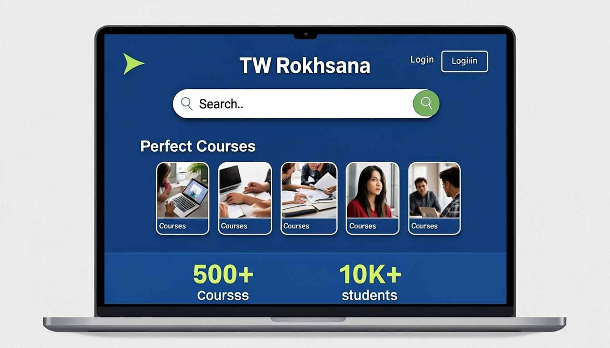
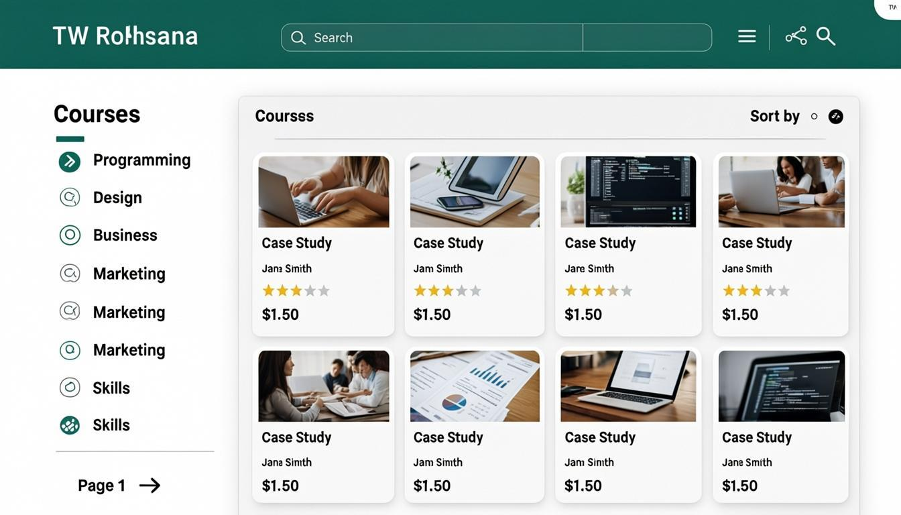
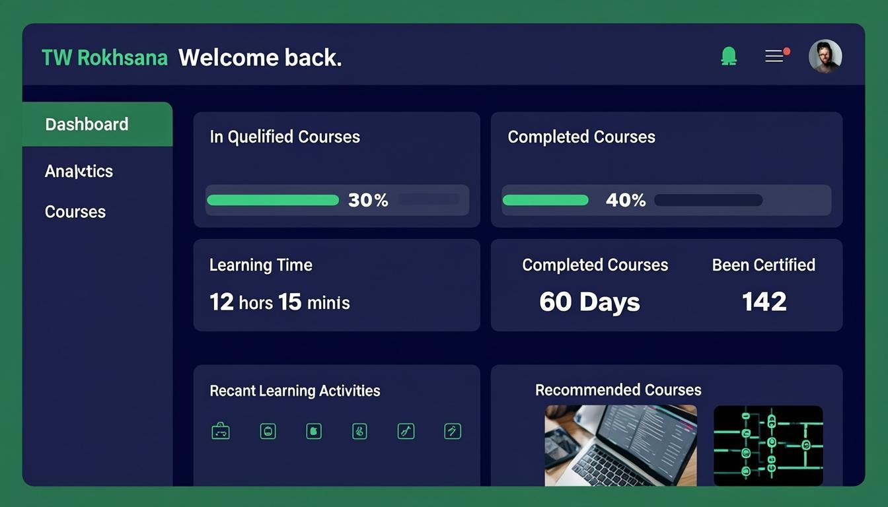

<div align="center">

# TW Rokhsana

### Modern Online Learning Platform

[](https://nextjs.org/)
[](https://www.typescriptlang.org/)
[](https://tailwindcss.com/)
[](https://ui.shadcn.com/)
[](https://www.prisma.io/)
[](https://zustand-demo.pmnd.rs/)
[](https://opensource.org/licenses/MIT)
[](https://github.com/tarikbilla)

</div>

---

## Overview

**TW Rokhsana** is a full-featured, modern online learning platform built with cutting-edge web technologies. It provides a seamless experience for students to discover, enroll in, and complete courses, while giving administrators powerful tools to manage content, users, and analytics.

The platform features a clean, intuitive UI with a dark navy blue and emerald green color scheme, responsive design for all devices, and real-time progress tracking.

---

## Screenshots

### Landing Page
The welcoming homepage with hero section, featured courses, and platform statistics.



### Course Catalog
Browse and filter through the complete course library with advanced search.



### Course Detail
In-depth course view with curriculum, reviews, and enrollment options.


### Learning Interface
Immersive video player with sidebar curriculum and note-taking tools.

### Student Dashboard
Personal dashboard with enrolled courses, progress tracking, and achievements.



### Admin Panel
Comprehensive admin dashboard for managing users, courses, and platform analytics.

---

## Features

### For Students

- **Course Discovery** — Browse, search, and filter courses by category, level, and rating
- **Video Learning** — Built-in video player with playback controls and speed options
- **Progress Tracking** — Real-time progress bars and completion percentages
- **Note Taking** — In-lesson note-taking with automatic save
- **Certificates** — Earn certificates upon course completion
- **Dashboard** — Personalized dashboard with enrolled courses and recommendations
- **Responsive Design** — Learn on any device — desktop, tablet, or mobile
- **Dark/Light Mode** — Toggle between themes for comfortable viewing

### For Administrators

- **User Management** — View, search, and manage all platform users and roles
- **Course Management** — Create, edit, and organize course content and curriculum
- **Analytics Dashboard** — Track enrollment trends, revenue, and platform performance
- **Content Moderation** — Review and approve user-generated content
- **Revenue Tracking** — Monitor sales, subscriptions, and financial metrics
- **Role-Based Access** — Granular permissions for admins, instructors, and moderators

---

## Tech Stack

| Technology | Purpose |
|---|---|
| [Next.js 16](https://nextjs.org/) | React framework with App Router |
| [TypeScript 5](https://www.typescriptlang.org/) | Type-safe JavaScript |
| [Tailwind CSS 4](https://tailwindcss.com/) | Utility-first CSS framework |
| [shadcn/ui](https://ui.shadcn.com/) | Accessible UI component library |
| [Prisma ORM](https://www.prisma.io/) | Database ORM with SQLite |
| [Zustand](https://zustand-demo.pmnd.rs/) | Lightweight client state management |
| [TanStack Query](https://tanstack.com/query) | Server state management |
| [Lucide Icons](https://lucide.dev/) | Beautiful open-source icons |
| [next-themes](https://github.com/pacocoursey/next-themes) | Dark/light mode support |
| [next-auth](https://next-auth.js.org/) | Authentication provider |

---

## Getting Started

### Prerequisites

- **Node.js** >= 18
- **Bun** (recommended) or npm/yarn
- **Git**

### Installation

```bash
# Clone the repository
git clone https://github.com/tarikbilla/TWRokhsana.git
cd TWRokhsana

# Install dependencies
bun install

# Set up the database
cp .env.example .env
bun run db:push

# Start the development server
bun run dev
```

The application will be available at `http://localhost:3000`.

### Environment Variables

| Variable | Description | Default |
|---|---|---|
| `DATABASE_URL` | SQLite database path | `file:./db.sqlite` |
| `NEXTAUTH_SECRET` | Secret for NextAuth.js | — |
| `NEXTAUTH_URL` | Base URL for NextAuth | `http://localhost:3000` |

---

## API Endpoints

| Method | Endpoint | Description |
|---|---|---|
| `GET` | `/api` | Health check / API status |
| `GET` | `/api/courses` | List all courses with filters |
| `GET` | `/api/courses/:id` | Get course details by ID |
| `POST` | `/api/courses` | Create a new course (Admin) |
| `PUT` | `/api/courses/:id` | Update a course (Admin) |
| `DELETE` | `/api/courses/:id` | Delete a course (Admin) |
| `GET` | `/api/courses/:id/lessons` | Get course curriculum |
| `POST` | `/api/courses/:id/enroll` | Enroll in a course |
| `GET` | `/api/users/me` | Get current user profile |
| `GET` | `/api/users/me/courses` | Get enrolled courses |
| `GET` | `/api/users/me/progress` | Get learning progress |
| `PUT` | `/api/users/me/progress/:lessonId` | Update lesson progress |
| `GET` | `/api/admin/users` | List all users (Admin) |
| `GET` | `/api/admin/analytics` | Platform analytics (Admin) |
| `POST` | `/api/auth/register` | Register a new account |
| `POST` | `/api/auth/login` | Login with credentials |
| `POST` | `/api/auth/logout` | Logout current session |

---
## TW Rokhsana - Access Guide (Default Accounts)

### Admin Account
| Field    | Value                   |
|----------|------------------------|
| Role     | Admin                  |
| Email    | admin@twrokhsana.com   |
| Password | Admin@123              |

### Student Account
| Field    | Value                     |
|----------|--------------------------|
| Role     | Student                  |
| Email    | student@twrokhsana.com   |
| Password | Student@123              |

### Instructor Account
| Field    | Value                        |
|----------|-----------------------------|
| Role     | Instructor                  |
| Email    | instructor@twrokhsana.com   |
| Password | Instructor@123              |

### Application Access

| Environment | URL                      |
|------------|--------------------------|
| Production | Your deployed URL        |
| Development| http://localhost:3000    |
---

## Project Structure

```
TWRokhsana/
├── prisma/
│   ├── schema.prisma          # Database schema definitions
│   └── migrations/             # Database migration files
├── public/
│   ├── logo.svg               # Platform logo
│   └── images/                # Static images
├── screenshots/                # Application screenshots
├── src/
│   ├── app/
│   │   ├── layout.tsx          # Root layout with providers
│   │   ├── page.tsx            # Main landing page
│   │   ├── globals.css         # Global styles & Tailwind config
│   │   └── api/                # API route handlers
│   │       ├── route.ts        # API entry point
│   │       ├── courses/        # Course-related endpoints
│   │       ├── users/          # User-related endpoints
│   │       ├── admin/          # Admin-only endpoints
│   │       └── auth/           # Authentication endpoints
│   ├── components/
│   │   ├── ui/                 # shadcn/ui base components
│   │   ├── layout/             # Header, Footer, Sidebar
│   │   ├── courses/            # Course cards, filters, player
│   │   ├── dashboard/          # Dashboard widgets, charts
│   │   └── admin/              # Admin panel components
│   ├── hooks/                  # Custom React hooks
│   │   ├── use-toast.ts        # Toast notifications
│   │   └── use-mobile.ts       # Mobile detection
│   ├── lib/
│   │   ├── db.ts               # Prisma database client
│   │   ├── utils.ts            # Utility functions
│   │   └── auth.ts             # Authentication configuration
│   └── stores/                 # Zustand state stores
├── .env                        # Environment variables
├── .gitignore
├── package.json
├── tsconfig.json
├── tailwind.config.ts
└── README.md
```

---

## Available Scripts

| Command | Description |
|---|---|
| `bun run dev` | Start development server on port 3000 |
| `bun run build` | Build for production |
| `bun run start` | Start production server |
| `bun run lint` | Run ESLint checks |
| `bun run db:push` | Push schema changes to database |
| `bun run db:generate` | Generate Prisma Client |
| `bun run db:migrate` | Run database migrations |
| `bun run db:reset` | Reset database to initial state |

---

## Contributing

1. Fork the repository
2. Create your feature branch: `git checkout -b feature/my-feature`
3. Commit your changes: `git commit -m 'Add my feature'`
4. Push to the branch: `git push origin feature/my-feature`
5. Open a Pull Request

---

## Author

**Tarik Billa**

- GitHub: [https://github.com/tarikbilla](https://github.com/tarikbilla)

---

## License

This project is licensed under the MIT License. See the [LICENSE](LICENSE) file for details.

---

<div align="center">

**Built with Next.js 16**

Made with passion by [Tarik Billa](https://github.com/tarikbilla)

</div>
